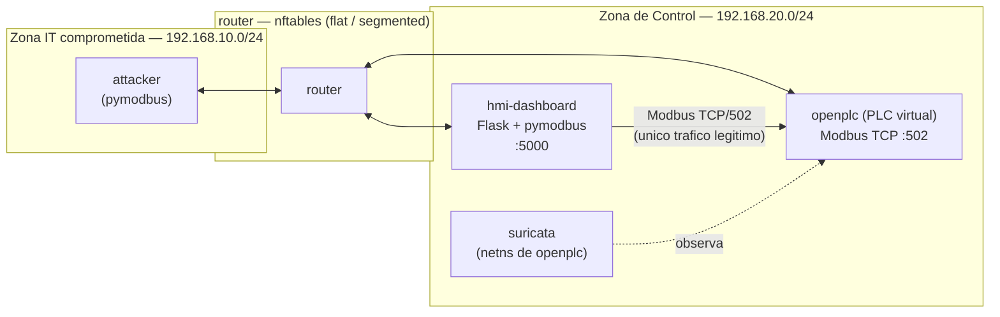
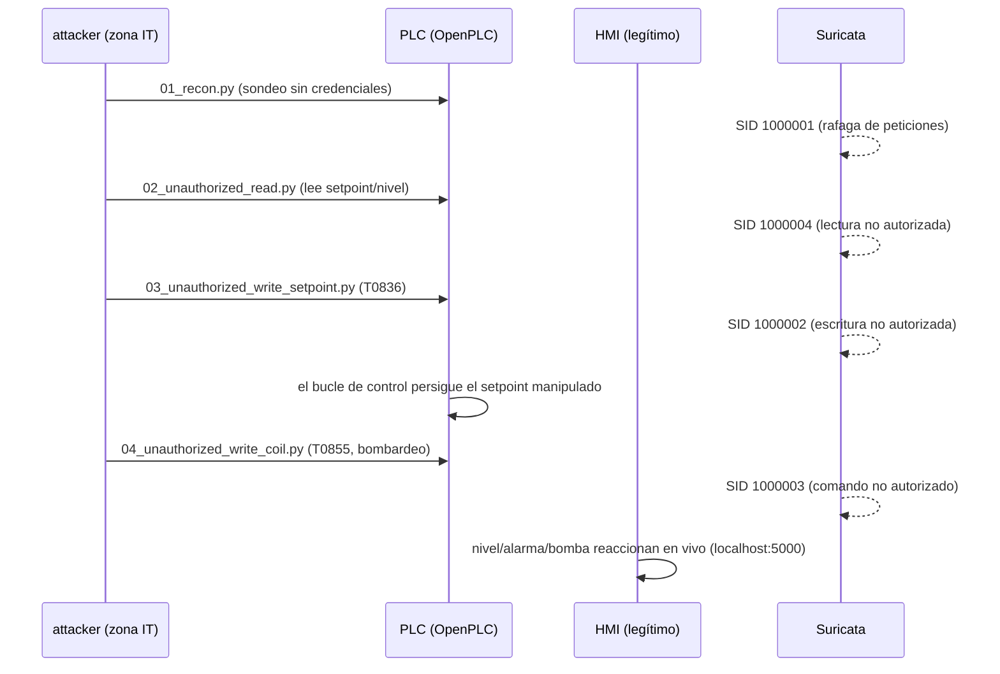

# Laboratorio OT/ICS: ataque, detección y segmentación IEC 62443

Laboratorio de ciberseguridad industrial **100% simulado y aislado**: un PLC
virtual (OpenPLC) controlando un depósito, un ataque de demostración contra
Modbus TCP mapeado a **MITRE ATT&CK for ICS**, su **detección** con Suricata,
y una **segmentación de red IEC 62443** aplicada de verdad (no solo en un
diagrama) que se puede comparar antes/después contra el mismo ataque.

> **Alcance y restricciones:** todo el tráfico ofensivo de este repo apunta
> únicamente al PLC virtual desplegado por `docker-compose.yml`, en redes
> Docker aisladas (`internal: true`, sin salida a Internet). Los scripts de
> `attack/` incluyen un guardarraíl (`_lab_guard.py`) que aborta la ejecución
> si el objetivo no está en esa subred. Nada de este repo debe usarse contra
> ningún sistema real.

## Por qué este laboratorio

Proyecto de portafolio para roles de ciberseguridad OT/ICS (automoción,
energía). No es solo "aquí hay un ataque": el objetivo es demostrar el ciclo
completo que se espera de un analista/ingeniero de seguridad industrial —
entender el proceso físico, explotar la falta de autenticación de Modbus de
forma controlada, detectarlo, y proponer (e implementar) una mitigación
arquitectónica real según un estándar del sector (IEC 62443).

## Arquitectura



Detalle de zonas, conductos y Security Levels (SL-T/SL-A) en
[`segmentation/IEC62443_zonas_conductos.md`](segmentation/IEC62443_zonas_conductos.md).

## Proceso simulado

Depósito con bomba de llenado y control on/off de nivel, con un interlock de
seguridad de nivel alto independiente del setpoint. Ver
[`plc/PROCESO.md`](plc/PROCESO.md) para el mapa completo de registros Modbus.

## Cadena de ataque → detección



Mapeo completo a MITRE ATT&CK for ICS: [`attack/README.md`](attack/README.md) ·
[`docs/mitre_attack_ics_mapping.md`](docs/mitre_attack_ics_mapping.md).

## Estructura del repositorio

```
plc/            programa ST del PLC + explicación del proceso y su mapa Modbus
hmi/            HMI legítimo (Flask + pymodbus)
attack/         scripts de demostración del ataque (pymodbus), con guardarraíl de laboratorio
detection/      reglas Suricata para Modbus + evidencia (pcap/eve.json)
segmentation/   modelo de zonas y conductos IEC 62443 + evidencia antes/después
iac/router/     contenedor router/firewall (nftables) que aplica el conducto
docs/           mapeo MITRE ATT&CK detallado + lecciones aprendidas
```

## Quickstart

Requiere Docker y Docker Compose. En Windows, todos los comandos `make` de
abajo son equivalentes a los comandos `docker compose` que aparecen entre
paréntesis, para quien no tenga `make` instalado.

```bash
# 1. Levantar el laboratorio
make up                     # docker compose up -d --build

# 2. Configuracion manual, una sola vez: abrir http://localhost:8080,
#    entrar con el usuario/clave por defecto de OpenPLC (openplc/openplc;
#    verificar y cambiar en el primer arranque), subir plc/tank_control.st
#    en "Programs", compilarlo, y en "Settings" habilitar el servidor
#    Modbus TCP en el puerto 502.

# 3. Ver el HMI en vivo
#    http://localhost:5000

# 4. Ejecutar el ataque en red plana (estado inicial)
make flat                   # docker compose exec router /rules/flat.sh
make attack-recon
make attack-read
make attack-write-setpoint
make attack-write-coil

# 5. Aplicar el conducto IEC 62443 y repetir el mismo ataque
make segmented               # docker compose exec router /rules/segmented.sh
make attack-write-setpoint   # ahora deberia quedar bloqueado en el router

# 6. Parar el laboratorio
make down                    # docker compose down
```

Guía completa de la demo de detección/segmentación:
[`detection/README.md`](detection/README.md).

## Capturas esperadas

*(Añadir aquí tras ejecutar el laboratorio: captura del HMI con el nivel
subiendo tras el ataque al setpoint, salida de `docker compose logs
suricata` con la alerta SID 1000002 en modo `flat`, y salida de `docker
compose logs router` con la línea `CONDUCTO-BLOQUEADO` en modo `segmented`.)*

## Qué aprendí

Ver [`docs/lecciones_aprendidas.md`](docs/lecciones_aprendidas.md).

## Stack y por qué

| Componente | Elección | Por qué |
|------------|----------|---------|
| PLC | OpenPLC v3 (build oficial desde su repo) | IEC 61131-3 real (Structured Text) + servidor Modbus TCP, sin depender de una imagen Docker de terceros |
| HMI | Flask + pymodbus (propio) | Control total del cliente Modbus "legítimo" y del look de las capturas; más código propio demostrable que un SCADA de terceros |
| Ataque | Python + pymodbus | Librería estándar de facto para Modbus en Python, API clara para ilustrar cada primitiva del protocolo |
| Detección | Suricata (`app-layer modbus`) | IDS de referencia en el sector con soporte nativo del protocolo, ampliamente usado en SOCs OT reales |
| Segmentación | nftables en un contenedor router | Permite demostrar, no solo describir, el efecto de un conducto IEC 62443 |
| Orquestación | Docker Compose | Un solo `docker compose up` reproduce todo el laboratorio en cualquier máquina |
