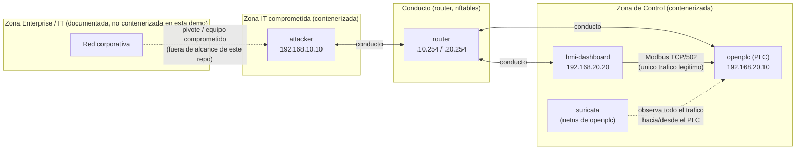

# Segmentación IEC 62443: modelo de zonas y conductos

## 1. Por qué segmentar (y por qué no basta con detectar)

`attack/README.md` muestra que Modbus TCP no tiene autenticación: cualquier
cliente que alcance el puerto 502 del PLC puede leer y escribir registros.
Suricata (`detection/`) puede **detectar** ese tráfico, pero detectar no es
prevenir — para cuando la alerta llega, la escritura ya ocurrió. IEC 62443-3-3
(control de acceso a la red, requisito de "network segmentation") propone
resolver esto arquitectónicamente: dividir la red en **zonas** con necesidades
de seguridad homogéneas, y permitir solo el tráfico estrictamente necesario
entre ellas a través de **conductos** con política explícita.

Este laboratorio implementa esa idea de forma ejecutable, no solo como
diagrama: `iac/router/` aplica dos posturas de red intercambiables
(`flat.sh` / `segmented.sh`) sobre la misma topología, para poder comparar
el mismo ataque en ambas.

## 2. Zonas del laboratorio

| Zona | Contenida en este repo | Activos | Necesidad de seguridad |
|------|--------------------------|---------|--------------------------|
| Enterprise/IT | No (documentada) | Puestos de usuario, correo, ERP | Alta disponibilidad, sin requisitos de determinismo de proceso |
| **IT comprometida** | Sí — `attacker` | Host que representa un equipo IT ya comprometido, pivotando hacia OT | N/A (es el origen de la amenaza modelada) |
| **Control** | Sí — `openplc`, `hmi-dashboard` | PLC y su HMI | Integridad y disponibilidad del proceso; SL objetivo alto en integridad |

La zona Enterprise/DMZ completa (con su propio conducto adicional hacia la
zona IT comprometida) se deja fuera de la implementación contenerizada
porque no aporta más evidencia ejecutable que la ya lograda con dos zonas —
se documenta aquí como extensión natural (ver §5).

## 3. Conductos y política

| Conducto | Origen | Destino | Protocolo/puerto | Política en `flat.sh` | Política en `segmented.sh` |
|----------|--------|---------|-------------------|--------------------------|-------------------------------|
| IT comprometida → Control | `attacker` (192.168.10.10) | `openplc` (192.168.20.10) | Modbus TCP/502 | Permitido (todo) | **Bloqueado y registrado** |
| HMI → PLC | `hmi-dashboard` (192.168.20.20) | `openplc` (192.168.20.10) | Modbus TCP/502 | Permitido | Permitido (único conducto autorizado) |
| Cualquier otro tráfico entre zonas | — | — | — | Permitido | Bloqueado por política DROP por defecto |

`iac/router/rules/segmented.sh` implementa exactamente esta tabla con
`nftables`: política `forward` por defecto en DROP, una única regla ACCEPT
para el conducto legítimo, y una regla explícita de LOG+DROP para cualquier
intento desde la zona IT hacia la zona de Control (evidencia en
`detection/evidence/`).

## 4. Security Levels (SL-T vs SL-A) — IEC 62443-3-3

| Zona | SL-T (objetivo) | SL-A antes de segmentar (`flat`) | SL-A después de segmentar (`segmented`) |
|------|------------------|-------------------------------------|---------------------------------------------|
| Control | SL2 (protección frente a atacante con intención, recursos moderados) | SL0 — sin control de acceso de red; Modbus abierto a cualquier origen | SL1-SL2 — solo el conducto HMI→PLC cruza la frontera de zona; Suricata añade detección como capa adicional |

La segmentación por sí sola no autentica Modbus (sigue sin haber usuario ni
contraseña dentro de la zona de Control: `hmi-dashboard` y `openplc` siguen
confiando ciegamente entre sí). Por eso el SL-A realista tras segmentar es
"SL1-SL2", no SL2 pleno — sería necesario además, por ejemplo, un gateway de
protocolo con listas de comandos permitidos (allow-listing a nivel de función
Modbus) dentro de la propia zona de Control para acercarse a SL2/SL3. Esta
honestidad en la evaluación (no vender la segmentación como solución total)
es intencional: es exactamente el tipo de matiz que se espera en un análisis
IEC 62443 real.

## 5. Evidencia: mismo ataque, antes y después

Ver `detection/evidence/` para las capturas (`pcap`) y alertas (`eve.json`)
de `attack/03_unauthorized_write_setpoint.py` ejecutado:

- **En `flat`**: el paquete llega al PLC, el setpoint cambia, y Suricata
  genera una alerta (SID 1000005) — detección funciona, prevención no.
- **En `segmented`**: el paquete se descarta en el `router` (contador de la
  regla `CONDUCTO-BLOQUEADO`, consultable con
  `docker compose exec router nft list ruleset`) y nunca llega al PLC — la
  conexión del atacante falla por timeout y no hay alerta de Suricata porque
  el ataque nunca alcanza la zona de Control. Prevención funciona.

Esta comparación es la demostración práctica de **defensa en profundidad**:
ninguna de las dos capas por sí sola es suficiente (la segmentación no
detecta un ataque que sí cruce el conducto legítimo comprometiendo el propio
HMI; la detección sin segmentación solo avisa después del hecho), pero juntas
cubren escenarios distintos.

## 6. Trabajo futuro (fuera del alcance de esta demo)

- Zona Enterprise/DMZ completa, con su propio conducto documentado.
- Gateway de protocolo Modbus con allow-listing de function codes dentro de
  la zona de Control (para subir el SL-A real, no solo el perimetral).
- Gestión de identidad/certificados para el HMI (Modbus TCP no lo soporta
  nativamente; requeriría un proxy TLS o migrar a un protocolo con soporte
  de seguridad como Modbus/TCP Security o DNP3 Secure Authentication).
